# 🛒 Walmart Sales Forecasting & Anomaly Detection

An end-to-end Data Science project for retail sales forecasting and anomaly detection using Machine Learning, deployed as a web application.


## 🔗 Live Demo
👉 **[Click here to try the app](https://sales-forecasting-qo03.onrender.com/)** ← replace with Render URL after deployment

---

## 📌 Project Overview

This project builds a complete sales forecasting system on the **Walmart Store Sales dataset (421K rows)** covering 45 stores and 99 departments from 2010–2012.

### What it does:
- **Forecasts weekly sales** at store-department level using XGBoost
- **Predicts overall sales trends** using Facebook Prophet
- **Detects anomalies** (Black Friday spikes, post-holiday crashes) using Isolation Forest
- **Serves predictions** via a Flask REST API with an interactive web dashboard

---

## 📊 Dataset

| Property | Value |
|---|---|
| Source | Walmart Store Sales (Kaggle) |
| Size | 421,570 rows |
| Stores | 45 |
| Departments | 99 |
| Date Range | 2010 – 2012 |
| Features | Temperature, Fuel Price, CPI, Unemployment, Markdowns, Holiday flags |

---

## 🧠 Models

### 1. XGBoost (Store-Department Level Forecasting)
- Trained on **355,349 rows** (80/20 time-based split)
- 14 features including economic indicators
- Log-transformed target for better MAPE
- **MAE: 3,178 | MAPE: 28.63%**

### 2. Prophet (Weekly Total Sales Forecasting)
- Time series on 143 weekly aggregated data points
- Captures yearly + weekly seasonality
- Multiplicative seasonality mode
- **MAPE: 2.22%**

### 3. Isolation Forest (Anomaly Detection)
- Unsupervised anomaly detection
- Detected **8 anomalies** in 143 weeks
- Correctly identified Black Friday (Nov 26) and Christmas (Dec 24) spikes
- Post-holiday crash (Jan 28) also flagged

---

## 📊 EDA Insights

### Sales Distribution
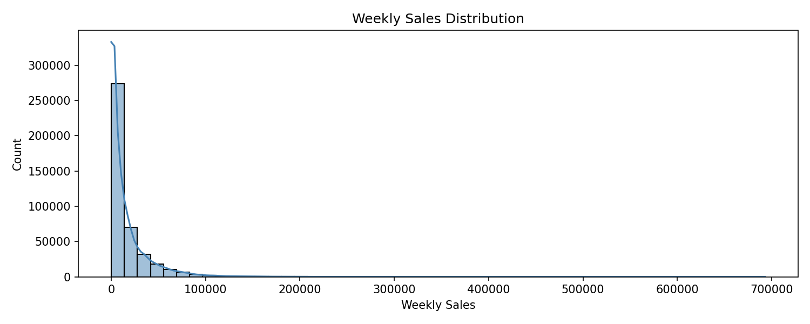

### Monthly Sales Trend
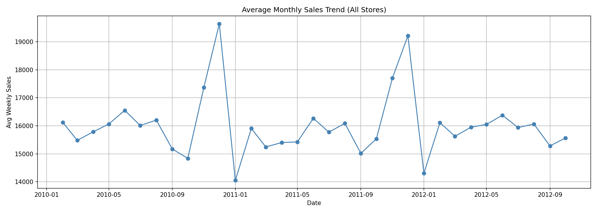

### Holiday Impact on Sales
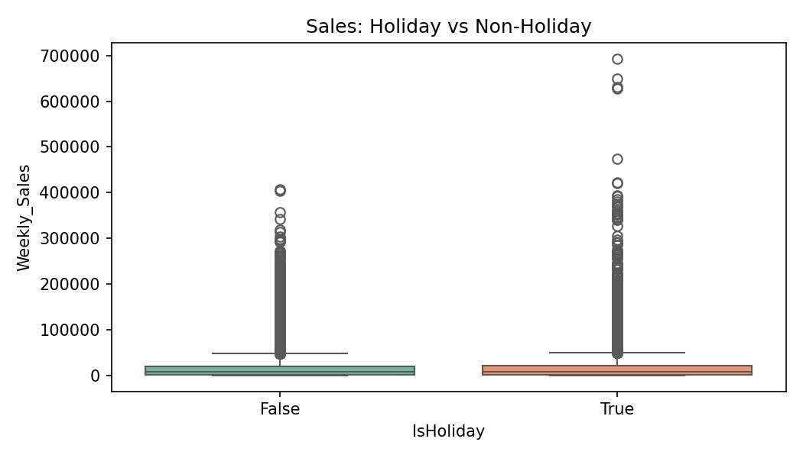

### Sales by Store Type
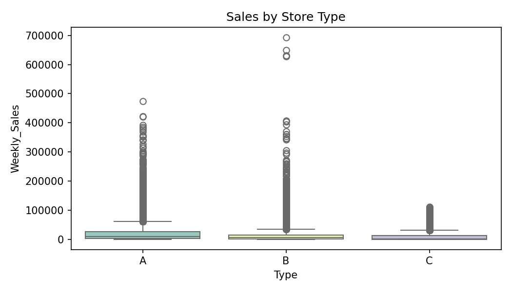

### Top 10 Departments by Sales
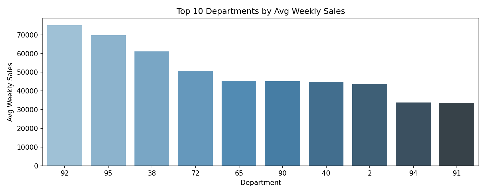

### Correlation Heatmap
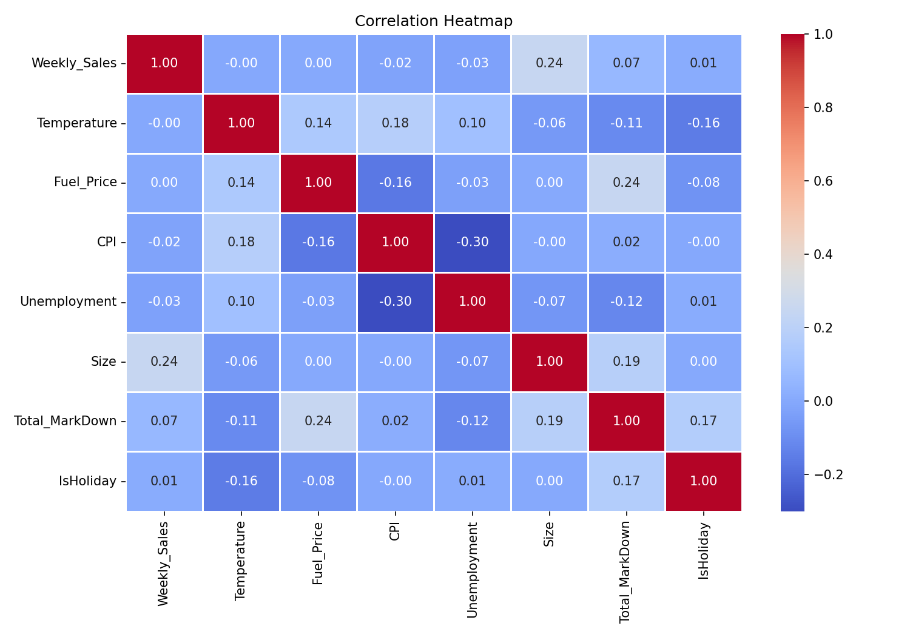

---

## 📈 Model Results

### Prophet Forecast
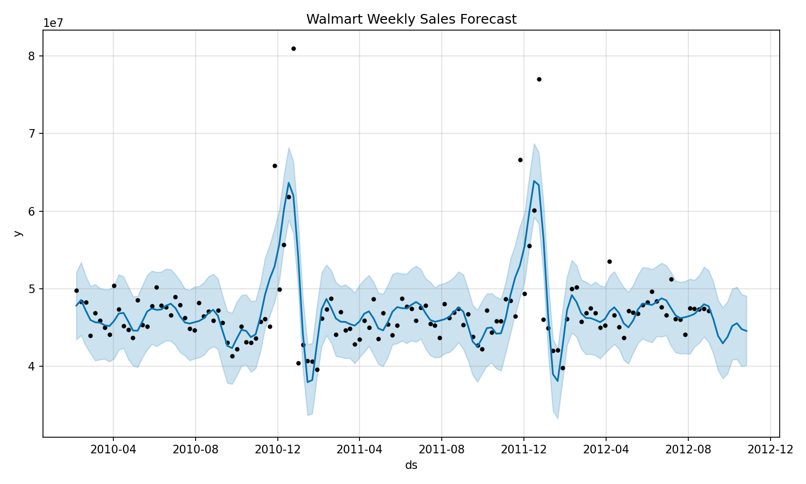

### Prophet Components (Trend + Seasonality)
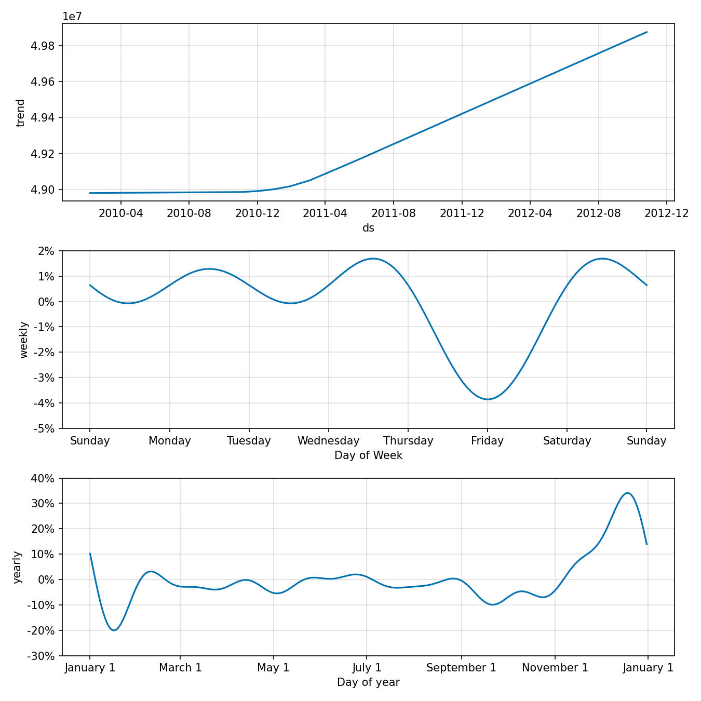

### Prophet Actual vs Predicted
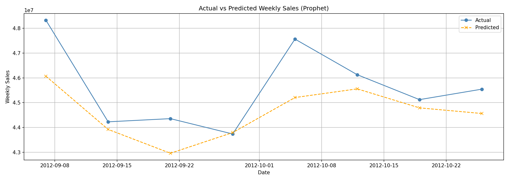

### XGBoost Feature Importance
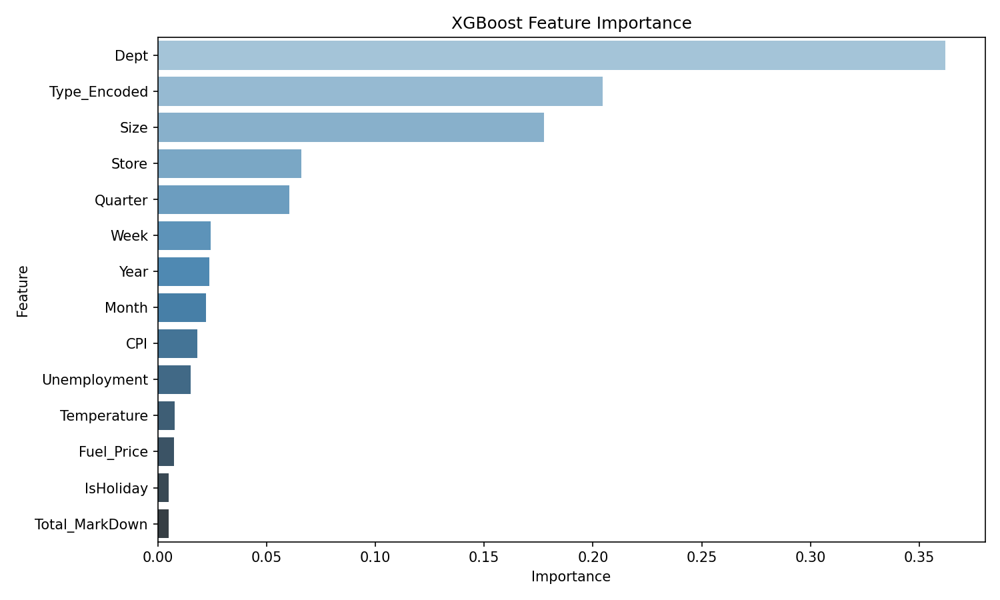

### XGBoost Actual vs Predicted
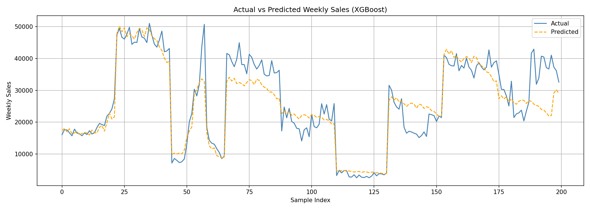

---

## 🚨 Anomaly Detection Results

### Anomaly Detection Plot
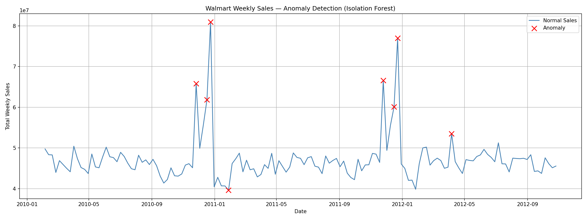

### Anomaly Scores Over Time
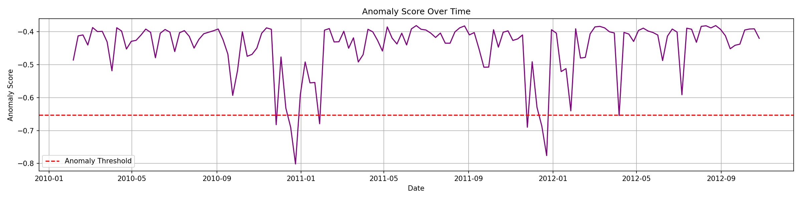

---

## 📁 Project Structure

```
sales-forecasting/
├── notebooks/
│   ├── 01_eda.ipynb                  ← Exploratory Data Analysis
│   ├── 02_prophet_model.ipynb        ← Prophet Forecasting
│   ├── 03_xgboost_model.ipynb        ← XGBoost Model
│   └── 04_anomaly_detection.ipynb    ← Isolation Forest
│
├── app/
│   ├── app.py                        ← Flask REST API
│   ├── model/
│   │   ├── xgboost_model.json
│   │   ├── isolation_forest_model.pkl
│   │   └── scaler.pkl
│   └── templates/
│       ├── index.html                ← Home Dashboard
│       ├── predict.html              ← Sales Prediction Page
│       └── anomaly.html              ← Anomaly Detection Page
│
├── data/
│   └── walmart_clean.csv
│
├── images/                           ← EDA and model plots
├── requirements.txt
├── Procfile
└── runtime.txt
```

---

## 🔌 API Endpoints

| Method | Endpoint | Description |
|---|---|---|
| GET | `/` | Home dashboard |
| GET | `/predict-page` | Sales prediction form |
| GET | `/anomaly-page` | Anomaly detection page |
| POST | `/predict` | XGBoost sales prediction |
| POST | `/anomaly` | Isolation Forest anomaly detection |
| GET | `/health` | API health check |

### Example: `/predict`
```json
POST /predict
{
  "store": 1,
  "dept": 1,
  "year": 2012,
  "month": 6,
  "week": 22,
  "quarter": 2,
  "is_holiday": 0,
  "temperature": 73.5,
  "fuel_price": 3.6,
  "cpi": 211.0,
  "unemployment": 7.8,
  "size": 151315,
  "type_encoded": 0,
  "total_markdown": 0
}

Response:
{
  "status": "success",
  "predicted_weekly_sales": 17382.55
}
```

### Example: `/anomaly`
```json
POST /anomaly
{
  "sales": [45000000, 46000000, 80000000, 44000000, 43000000]
}

Response:
{
  "status": "success",
  "total_points": 5,
  "anomaly_count": 1,
  "results": [...]
}
```

---

## 📈 Key EDA Findings

- **Holiday weeks** show 15-30% higher sales than regular weeks
- **Store Type A** (largest) generates 3x more revenue than Type C
- **Department** is the strongest predictor of sales (feature importance: 29%)
- **Black Friday and Christmas** cause the most significant sales anomalies
- Clear **yearly seasonality** with Q4 peak every year

---

## 🛠️ Tech Stack

| Layer | Technology |
|---|---|
| Data Processing | Pandas, NumPy |
| EDA | Matplotlib, Seaborn |
| Forecasting | Facebook Prophet |
| ML Model | XGBoost |
| Anomaly Detection | Scikit-learn Isolation Forest |
| API | Flask, REST |
| Frontend | HTML, CSS, Bootstrap 5 |
| Deployment | Render |

---

## 🚀 Run Locally

```bash
# Clone repo
git clone https://github.com/sandeepkr0209/sales-forecasting.git
cd sales-forecasting

# Create virtual environment
python -m venv venv
venv\Scripts\activate

# Install dependencies
pip install -r requirements.txt

# Run Flask app
cd app
python app.py
```

Open browser → `http://127.0.0.1:5000`

---

## 👨‍💻 Author

**Sandeep Kumar**
- GitHub: [@sandeepkr0209](https://github.com/sandeepkr0209)
- LinkedIn: [sandeepkumar-69241b256](https://linkedin.com/in/sandeepkumar-69241b256)
- Email: sankrdeep7510@gmail.com